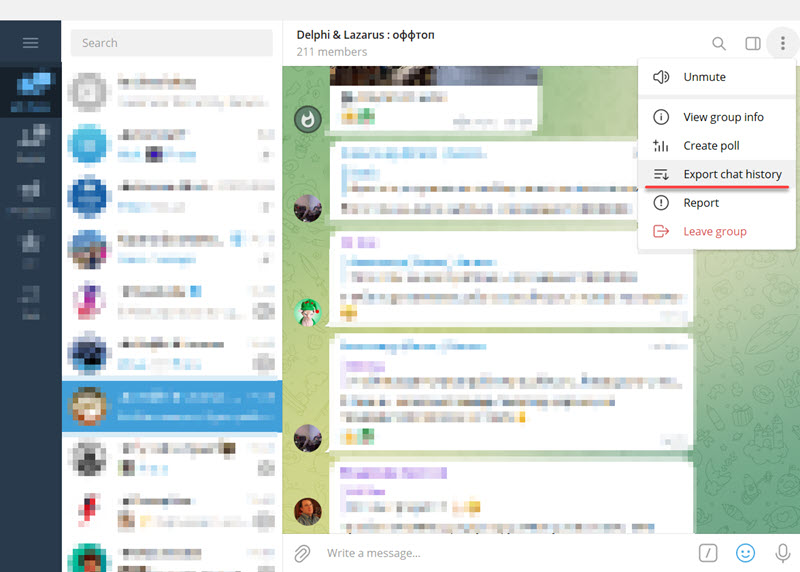

# TJSONIterator-test
WARNING: Spaghetti code. Sample of usage Delphi's [TJSONIterator](https://docwiki.embarcadero.com/Libraries/Alexandria/en/System.JSON.Builders.TJSONIterator) class in parsing Telegram's chat history JSON file. This class allows you to read large JSON data without loading whole file to the RAM.

This example count Telegram's group messages by users. Channel and service messages are not taken into account.

## Where to get Telegram's chat history JSON file

